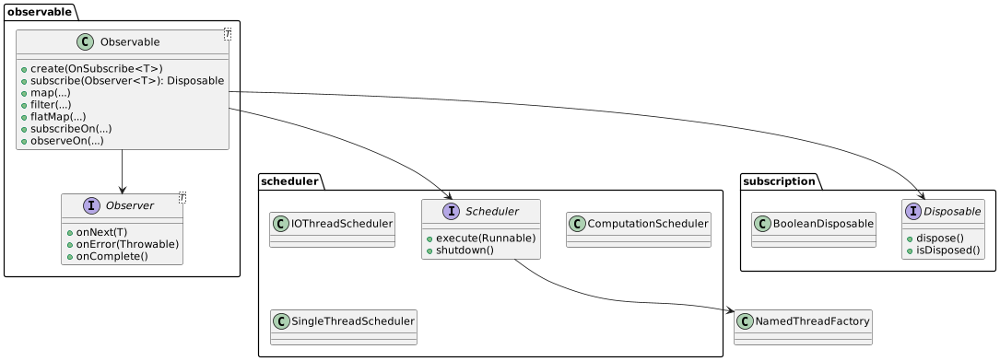

# Отчёт по реализации аналогичной RxJava-библиотеки

## Введение

Отчёт описывает поэтапную разработку учебной библиотеки, воспроизводящей основные принципы `RxJava`: реактивный
поток данных, перенос выполнения между потоками, управление подписками и обработка ошибок.

## Архитектура системы

Архитектура основана на классических компонентах реактивных фреймворков:

1. **Observer (Наблюдатель)**

- Интерфейс `com.edu.rxjava.observer.Observer<T>`, который определяет контракт:
    - `onNext(T item)` — получение следующего элемента потока.
    - `onError(Throwable t)` — обработка возникшей ошибки.
    - `onComplete()` — уведомление об успешном завершении.
- Предусмотрена возможность защиты колбэков от повторных вызовов или вызовов после `dispose()`.

2. **Observable (Наблюдаемый/Издатель)**

- Класс `com.edu.rxjava.observable.Observable<T>`:
    - Внутри хранит функциональный интерфейс `OnSubscribe<T>`, обеспечивающий логику эмиссии.
    - Фабричный метод `create(OnSubscribe<T> onSubscribe)` для создания потоков с произвольным поведением.
    - Метод `subscribe(Observer<T>): Disposable`, возвращающий `Disposable` для управления подпиской.
- Подписка не добавляет автоматического `onComplete()` — завершение контролируется самим `OnSubscribe`.

3. **Операторы преобразования и фильтрации**

- **`map(Function<? super T, ? extends R>)`** — преобразует каждый элемент через переданную функцию.
- **`filter(Predicate<? super T>)`** — пропускает только элементы, удовлетворяющие условию.
- **`flatMap(Function<? super T, Observable<R>>)`** — разворачивает вложенные потоки, объединяя элементы из них в один.
- Все операторы реализованы без изменений исходного потока (immutable chaining) и корректно обрабатывают исключения,
  перенаправляя их в `onError()`.

4. **Schedulers (Планировщики потоков)**
   Интерфейс `com.edu.rxjava.scheduler.Scheduler` с методами:

- `execute(Runnable task)` — выполнение задачи.
- `shutdown()` — корректное завершение пула.

Реализации:

- **`IOThreadScheduler`** (`Executors.newCachedThreadPool`) — масштабируется под IO-bound задачи.
- **`ComputationScheduler`** (`Executors.newFixedThreadPool(n)`), где
  `n = Runtime.getRuntime().availableProcessors()`, — для CPU-bound операций.
- **`SingleThreadScheduler`** (`Executors.newSingleThreadExecutor`) — для последовательного и детерминированного
  выполнения.

Методы `subscribeOn(scheduler)` и `observeOn(scheduler)` позволяют гибко менять контекст выполнения эмиссии и обработки
колбэков.

5. **Disposable (Управление подпиской)**

- Интерфейс `com.edu.rxjava.subscription.Disposable`: `dispose()` и `isDisposed()`.
- Реализация `BooleanDisposable` — простой флаг, останавливающий дальнейшую передачу событий после вызова `dispose()`.



## Принципы работы Schedulers

- **IOThreadScheduler**:
    - **Модель**: CachedThreadPool.
    - **Особенности**: динамическое создание потоков при пиковых нагрузках, повторное использование свободных потоков.
    - **Сценарии**: чтение/запись файлов, сетевые запросы, операции, блокирующиеся на вводе-выводе.

- **ComputationScheduler**:
    - **Модель**: FixedThreadPool, размер = числу доступных CPU.
    - **Особенности**: сбалансированное использование ядер, предотвращение чрезмерного контекста переключений.
    - **Сценарии**: вычислительно интенсивные операции (парсинг, расчёты, алгоритмы обработки данных).

- **SingleThreadScheduler**:
    - **Модель**: SingleThreadExecutor.
    - **Особенности**: предоставление гарантии единственного потока и строгого порядка выполнения задач.
    - **Сценарии**: обновление UI, последовательная логика, где порядок важнее производительности.

- **Контекстные методы**:
    - **`subscribeOn`** переносит начало эмиссии (вызов `onSubscribe.call`) в указанный планировщик.
    - **`observeOn`** перемещает все колбэки (`onNext/onError/onComplete`) в указанный планировщик, позволяя разделять
      потоки производства и потребления.

## Процесс тестирования и основные сценарии

Тестирование покрывает четыре ключевые области:

1. **Основные компоненты**:

- `ObserverTest`: валидация базовых методов и поведения интерфейса.
- `ObservableTest`: сценарии успешной эмиссии, исключений при создании и завершении.

2. **Операторы**:

- `ObservableOperatorTest` (map, filter):
    - Преобразование значений.
    - Фильтрация по условию.
    - Проброс ошибок из `Function`/`Predicate`.
- `ObservableFlatMapTest` (flatMap):
    - Слияние вложенных потоков.
    - Проброс ошибок при создании вложенного `Observable`.

3. **Schedulers**:

- `SchedulerTest`: проверка работы `subscribeOn`/`observeOn` и факта выполнения в потоках с ожидаемыми именами.
- `SchedulerParallelismTest`: оценка параллелизма в `IOThreadScheduler` и `ComputationScheduler`, последовательности в
  `SingleThreadScheduler`.

4. **Disposable и отмена подписки**:

- `DisposableTest`: убеждение, что после вызова `dispose()` поток эмиссии прекращает отправку элементов и не вызывает
  дальнейшие колбэки.

Все тесты запускаются командой:

```bash
mvn clean test
```

и проходят без ошибок, демонстрируя корректность реализации.

## Пример использования

```java
package com.edu.rxjava.demo;

import com.edu.rxjava.observable.Observable;
import com.edu.rxjava.observer.Observer;
import com.edu.rxjava.scheduler.IOThreadScheduler;
import com.edu.rxjava.scheduler.SingleThreadScheduler;
import com.edu.rxjava.subscription.Disposable;

public class ExampleUsage {

  public static void main(String[] args) throws InterruptedException {
    // 1. Простое Observable с операторами map, filter, flatMap
    Observable<Integer> src = Observable.create(emitter -> {
      emitter.onNext(10);
      emitter.onNext(20);
      emitter.onComplete();
    });

    Disposable disp = src
            .map(i -> i * 3)                            // 30, 60
            .filter(i -> i > 30)                        // только 60
            .flatMap(i ->
                    Observable.create(inner -> {
                      inner.onNext("Value: " + i);
                      inner.onComplete();
                    })
            )
            .subscribe(new Observer<String>() {
              @Override
              public void onNext(String item) {
                System.out.println("[onNext] " + item);
              }
              @Override
              public void onError(Throwable t) {
                System.err.println("[onError] " + t);
              }
              @Override
              public void onComplete() {
                System.out.println("[onComplete] Stream completed.");
              }
            });

    // 2. Асинхронное выполнение через Schedulers
    IOThreadScheduler ioScheduler = new IOThreadScheduler();
    SingleThreadScheduler singleScheduler = new SingleThreadScheduler();

    src.subscribeOn(ioScheduler)
            .observeOn(singleScheduler)
            .subscribe(new Observer<Integer>() {
              @Override
              public void onNext(Integer i) {
                System.out.println("[async onNext on " + Thread.currentThread().getName() + "] " + i);
              }
              @Override
              public void onError(Throwable t) {
                System.err.println("[async onError] " + t);
              }
              @Override
              public void onComplete() {
                System.out.println("[async onComplete] Finished on " + Thread.currentThread().getName());
              }
            });

    // Несколько миллисекунд ждём, чтобы асинхронные задачи завершились
    Thread.sleep(200);

    // 3. Отмена подписки (если нужно)
    // disp.dispose();

    // 4. Завершаем работу планировщиков
    ioScheduler.shutdown();
    singleScheduler.shutdown();
  }
}

```

